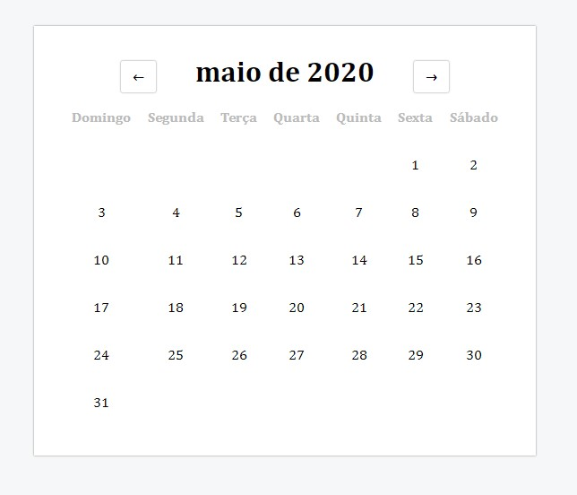

# :calendar: Calendário Simples

Um calendário muito simples desenvolvido com apenas Javascript, HTML e CSS.

**:rocket: Tecnologias:**

- [HTML5](https://www.w3schools.com/html/)
- [Javascript](https://developer.mozilla.org/pt-BR/docs/Web/JavaScript)
- [CSS3](https://developer.mozilla.org/pt-BR/docs/Web/CSS/)

---

:coffee: Desenvolvido por Daniel Santos

